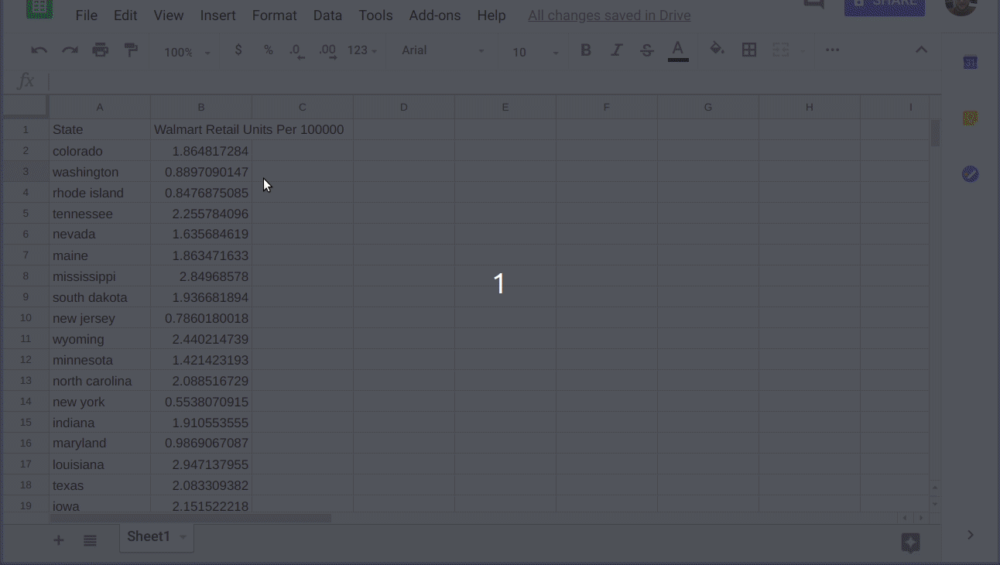
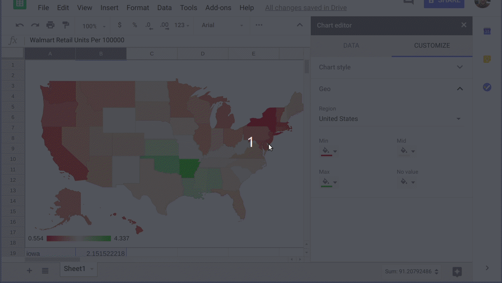

# Generating a US Chloropleth using Google Sheets
## Setup
Get a dataset that is a listing of all 50 states and some numerical value.  For this example I'm relying on quick pull of state population and Walmart retail sites to calculation the number people per store.  

## Steps
1. Generate the dataset.  (I have no idea what your python setup is like so I've included my copy of the dataset.csv if you don't want to run it.)
    ```
    python walmartCount.py
    ```  

1. Verify that the dataset was created.  Header row with column description and two columns of data that follow the normal key=value pairing.
    ```
    $ ls -l dataset.csv 
    -rw-r--r-- 1 chad chad 1447 Dec 29 04:24 dataset.csv
    $ head -3 dataset.csv 
    State,Walmart Retail Units Per 100000
    colorado,1.8648172839710333
    washington,0.8897090146910878
    $
    ```  

1. Paste this data into a fresh Google Sheet.  Then split the data into multiple columns.  

    

1. Insert a chart and select the correct chloropleth geographic map.  Google is doing the hardwork so as long as your data set is correctly formatted it will generate for you.    

    

1. Most of the time you are going to display data along a single color instead of the default red/green mix.  Play around with min/max/mid color choices for what is appropiate with your data.  

    


## Conclusion
You now have a rough idea of which states have the most Walmart stores per capita.  Not suprising is that Walmart's home state of Arkansas has the densest ratio.  New Hampshire vs Vermont is another one that suprised me.  

You should be able to recreate this type of work for any other set of similarly formatted data.